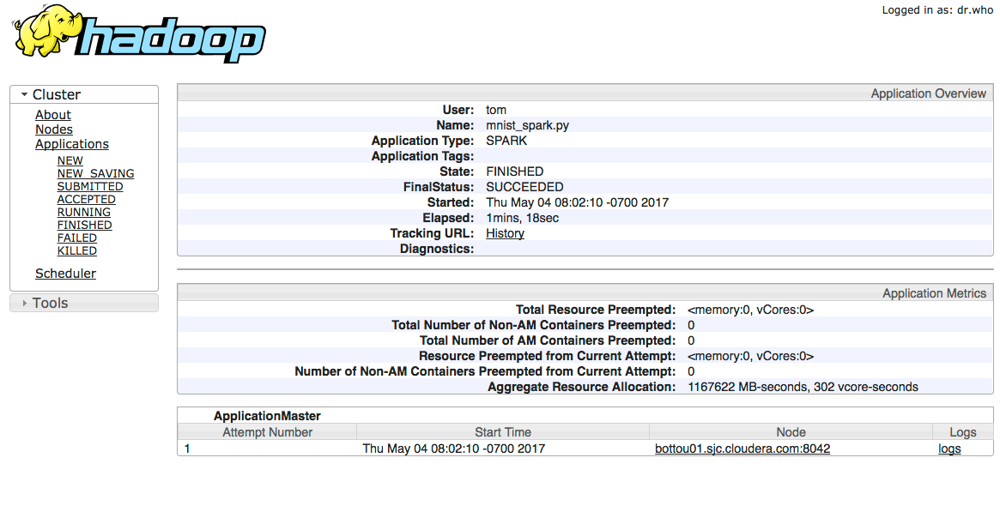

# TensorFlow on Spark demo

This demo shows how to use TensorFlow to run distributed training on a CDH cluster.
It is based on [https://github.com/yahoo/TensorFlowOnSpark/wiki/GetStarted_YARN](https://github.com/yahoo/TensorFlowOnSpark/wiki/GetStarted_YARN), with the following differences:

* A Conda env is used, rather than building Python and TensorFlow from scratch.
* RDMA is not used, so vanilla TensorFlow is all that is needed.

Further information about using Conda is available from [this blog post](https://blog.cloudera.com/blog/2017/04/use-your-favorite-python-library-on-pyspark-cluster-with-cloudera-data-science-workbench/).

There are also useful tips for running TensorFlow on Spark in [this blog post](https://blog.cloudera.com/blog/2017/04/deep-learning-frameworks-on-cdh-and-cloudera-data-science-workbench/).

## Installation

First create a Conda env. This will take a few minutes.

```bash
./create-tf-conda-env.sh
```

Next, install TensorFlowOnSpark:

```bash
git clone https://github.com/yahoo/TensorFlowOnSpark
pushd TensorFlowOnSpark/src
zip -r ../tfspark.zip *
popd
```

## Data preparation

Download the MNIST data, then turn it into a suitable format for TensorFlow, and store 
in HDFS.

```bash
./prepare-mnist-data.sh
./convert-mnist-data.sh
```

Check that the output files were created:

```bash
hadoop fs -ls -R mnist/csv
```

## Training

Train the model by running:

```bash
./train-mnist-dist.sh
```

You can see the exact `mnist_spark.py` command that was run by looking in the YARN logs;
 see lower right link here:
 


```
args: Namespace(batch_size=100, cluster_size=4, epochs=1, format='csv', images='mnist/csv/train/images', labels='mnist/csv/train/labels', mode='train', model='mnist_model', output='predictions', rdma=False, readers=1, steps=1000, tensorboard=False)
```

The log also gives details of the worker nodes started and whether they are workers or the
parameter server.

```
2017-05-04 08:02:53,142 INFO (MainThread-60229) All TFSparkNodes started
2017-05-04 08:02:53,143 INFO (MainThread-60229) {'addr': '/tmp/pymp-_O_ESR/listener-8ojX3h', 'task_index': 0, 'port': 40479, 'authkey': 'A/\xb7\x12\xd81Nz\xae\xed\xb9\xc8\xcdk\xbe\xf0', 'worker_num': 1, 'host': 'bottou05.sjc.cloudera.com', 'ppid': 14391, 'job_name': 'worker', 'tb_pid': 0, 'tb_port': 0}
2017-05-04 08:02:53,143 INFO (MainThread-60229) {'addr': '/tmp/pymp-JHTvXb/listener-3bzG21', 'task_index': 2, 'port': 32911, 'authkey': '\xc3\xb2J\xf1^2E\xb8\x86\xf4\xfa:;\x05\xd8\xac', 'worker_num': 3, 'host': 'bottou05.sjc.cloudera.com', 'ppid': 14395, 'job_name': 'worker', 'tb_pid': 0, 'tb_port': 0}
2017-05-04 08:02:53,143 INFO (MainThread-60229) {'addr': '/tmp/pymp-mPraGu/listener-5goUGe', 'task_index': 1, 'port': 38436, 'authkey': '\x9fP\x1dQ\xe9\x8cH\xc4\xab4FMtm\xc1\xcf', 'worker_num': 2, 'host': 'bottou05.sjc.cloudera.com', 'ppid': 14393, 'job_name': 'worker', 'tb_pid': 0, 'tb_port': 0}
2017-05-04 08:02:53,143 INFO (MainThread-60229) {'addr': ('bottou05.sjc.cloudera.com', 39106), 'task_index': 0, 'port': 33978, 'authkey': 'r\t\xbf\x95\xbc\xbbGA\x99\xd2\xc2\xb1\x1b7\xcfs', 'worker_num': 0, 'host': 'bottou05.sjc.cloudera.com', 'ppid': 14392, 'job_name': 'ps', 'tb_pid': 0, 'tb_port': 0}
```